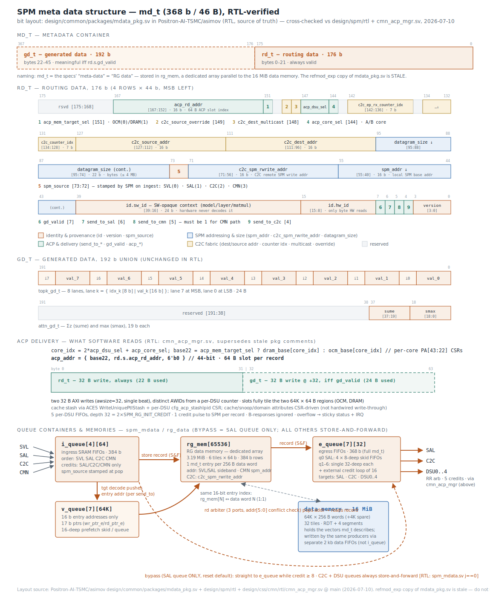

# SPM model

## data memory

Data memory is 16MB, unstructured. 64K words × 256 B (2048 b); 16-bit word address
(`[3:0]` bank, `[5:4]` segment, `[15:6]` row). +4K spare words → 17 MiB physical.
RTL-verified: `SPM_DATA_W=2048`, 32 tiles × 64 b, 16 banks/tile (RDT segment tiles: 4 banks),
2× 32 b × 1024 SRAM macros per bank, `SEG_CNT=5` (1 RDT + 4), `CHAIN_D=4`.

### Reference

- SPM spec, 5.4, "The 16-bit SPM address is…"
- RTL: `design/spm/rtl/spm_defines.svh` (`SPM_DATA_W`, `SPM_ADDR_W=16`), `spm.sv`
  (TILE_CNT=32, BANK_CNT=16, SEG_CNT=5), `spm_wr_ctrl_chain.sv` (addr[3:0] bank,
  addr[5:4] seg, addr[15:6] row)

## meta data

One 46 B (368 b) record `md_t` per 256 B data word, at the same 16-bit address:
routing data `rd_t` (176 b, bytes 0–21) + generated data `gd_t` (192 b, bytes 22–45,
meaningful iff `rd.s.gd_valid`). Records flow through 4 ingress queues, the RG memory,
and 7 egress queues; egress toward a DSU ends as two 32 B ACP writes into one 64 B slot.

**Naming:** the docs use "meta data" and "RG data" interchangeably — "meta-data" in SPM
spec §3, the RTL block `spm_mdata`, and `mdata_pkg`/`md_t`/`METADATA_WIDTH`; "RG data" in
SPM spec §5.5 and the RTL memory names `rg_mem`/`rg_fifo`. One record = one `md_t`. This
model uses `rg_data` for the SPM-side container to match the RG-prefixed storage names.

**Where it lives:** `rg_mem` is a *dedicated* metadata array — 3.19 MiB, 6 tiles × 64 b
(384 b physical rows), physically separate from the 16 MiB / 32-tile data memory. The
spec's "shares the same address space and bank organization" (5.5.1) means the two arrays
mirror each other's 16-bit *index space* 1:1 — `rg_mem[N]` describes data word N — not
that metadata occupies data storage. (There is also a third, VFIFO chain: 7 × 16-bit
tiles for the virtual queues, threaded through the same RDT+4-segment structure.)

### record format — source of truth (RTL)

⚠️ **The refmod_exp copy of `mdata_pkg.sv` is STALE.** The SPM RTL (`spm_mdata.sv`,
`spm_mdata_tgt_decode.sv`) imports the **RTL repo's** package —
`Positron-AI-TSMC/asimov: design/common/packages/mdata_pkg.sv` — whose `rd_t` layout is
completely different from the refmod_exp version (different bit positions, several fields
added/removed). RTL-verified layout, quoted verbatim:

```systemverilog
localparam int METADATA_WIDTH = 368;            // 46 B
localparam int SLS_GENERATED_DATA_WIDTH = 192;  // gd_t, 24 B
localparam int SLS_ROUTING_DATA_WIDTH =
    METADATA_WIDTH - SLS_GENERATED_DATA_WIDTH;  // rd_t, 176 b = 22 B

// Routing-data identifier — 32 bits: {sw_id, hw_id}
// hw_id is the LSB byte; SAL/SLS look at hw_id ONLY.
// sw_id is opaque to hardware — SW uses it to carry model/layer/matmul context end-to-end.
typedef struct packed {
  logic [23:0] sw_id;
  logic [ 7:0] hw_id;
} rd_id_t;

typedef enum logic [1:0] {                      // stamped by SPM on ingest
  SPM_SRC_SVL = 2'd0, SPM_SRC_SAL = 2'd1, SPM_SRC_C2C = 2'd2, SPM_SRC_CMN = 2'd3
} spm_source_t;

typedef union packed {
  logic [SLS_ROUTING_DATA_WIDTH-1:0] data;
  struct packed {  // rd.s.<field>
    logic [ 7:0]  rsvd_msb;               // [175:168] reserved padding to 22 bytes
    logic [15:0]  acp_rd_addr;            // [167:152] ACP routing-data addr
    logic         acp_mem_target_sel;     // [151]     per-DSU base sel (A=OCM, B=DRAM)
    logic         rsvd2;                  // [150]     reserved
    logic         c2c_source_override;    // [149]     alternate SA override
    logic         c2c_dest_multicast;     // [148]     unicast (0) / multicast (1)
    logic [ 2:0]  acp_dsu_sel;            // [147:145] target DSU (0-4)
    logic         acp_core_sel;           // [144]     A/B core select within DSU
    logic         rsvd1;                  // [143]     reserved
    logic [ 6:0]  c2c_ep_rx_counter_idx;  // [142:136] EP Rx statistics index
    logic         rsvd0;                  // [135]     reserved
    logic [ 6:0]  c2c_counter_idx;        // [134:128] C2C Rx & Tx statistics index
    logic [15:0]  c2c_source_addr;        // [127:112]
    logic [15:0]  c2c_dest_addr;          // [111:96]
    logic [21:0]  datagram_size;          // [95:74]   byte granularity (2^22 = 4MB)
    spm_source_t  spm_source;             // [73:72]   SVL(0) SAL(1) C2C(2) CMN(3)
    logic [15:0]  c2c_spm_rwrite_addr;    // [71:56]   C2C remote SPM write addr
    logic [15:0]  spm_addr;               // [55:40]   local SPM base addr
    rd_id_t       id;                     // [39:8]    {sw_id[23:0], hw_id[7:0]}
    logic         gd_valid;               // [7]       generated-data valid
    logic         send_to_sal;            // [6]
    logic         send_to_cmn;            // [5]       must be 1 for CMN path
    logic         send_to_c2c;            // [4]
    logic [ 3:0]  version;                // [3:0]     routing data version
  } s;
} rd_t;

// gd_t: unchanged from refmod — 192-bit union of
//   attn_gd_t { reserved[153:0], sume[18:0], smax[18:0] }
//   topk_gd_t { 8 lanes of {idx_k[7:0], val_k[15:0]}, lane 0 at LSB }
typedef struct packed {
  gd_t  gd;   // [367:176]
  rd_t  rd;   // [175:0]
} md_t;
```

### queue containers (golden-model view, RTL-verified)

```c++
// ============================ sizing =====================================
constexpr int SPM_ENTRIES        = 65536; // 64K md_t records, 1 per 256 B word
constexpr int MD_RECORD_BYTES    = 46;    // 368 b payload in 384 b row (MDATA_WIDE_W=6*64)
constexpr int INGRESS_QUEUE_CNT  = 4;     // WR_AGT_CNT: 0=SVL, 1=SAL, 2=C2C, 3=CMN
constexpr int INGRESS_QUEUE_LEN  = 64;    // SRAM sfifo, 384 b wide
constexpr int EGRESS_QUEUE_CNT   = 7;     // NUM_QUEUE: 0=SAL, 1=C2C, 2..6=DSU0..4
constexpr int EGRESS_QUEUE_LEN   = 32;    // RG_FIFO_DEPTH (368 b wide — NOT 360)
constexpr int EGRESS_EXT_CREDIT  = 16;    // RG_INIT_CREDIT / SPM_RG_INIT_CREDIT
constexpr int VIRTUAL_QUEUE_LEN  = 65536; // SRAM-backed (VFIFO tile chain)

struct rg_data {   // the spec's "meta data"; RTL block: spm_mdata
  // backing store: DEDICATED RG array (6 tiles x 64 b, 3.19 MiB) — physically
  // separate from the 16 MiB data memory; mirrors its 16-bit index space and
  // bank organization 1:1 (rg_mem[N] describes data word N)
  md_t     rg_mem[SPM_ENTRIES];

  // ingress: per-producer SRAM FIFOs; credit handshake for SAL/C2C/CMN, none
  // for SVL (overflow guarded only by assertion). spm_source is stamped at
  // FIFO POP, not at push.
  md_t     i_queue[INGRESS_QUEUE_CNT][INGRESS_QUEUE_LEN];

  // egress stage 1: per-target virtual queues hold 16-bit ADDRESSES into
  // rg_mem, pushed by tgt decode at write time; 17-bit wr/rd pointers
  // (vfifo_ptr regs expose wr_ptr_e/rd_ptr_e); 16-deep prefetch skid per queue
  uint16_t v_queue[EGRESS_QUEUE_CNT][VIRTUAL_QUEUE_LEN];
  uint32_t v_wr_ptr[EGRESS_QUEUE_CNT];
  uint32_t v_rd_ptr[EGRESS_QUEUE_CNT];

  // egress stage 2: per-target output FIFOs, full 368-bit records, 32 deep.
  // Queue 0 (SAL): 4 x 8-deep skid FIFOs; queues 1-6: single 32-deep FIFO in
  // spm_ctrl_south. External credit loop to each consumer = 16 (2nd tier).
  // 5 DSU queues RR-arbitrated into one CMN stream; CMN returns 5 credits.
  md_t     e_queue[EGRESS_QUEUE_CNT][EGRESS_QUEUE_LEN];
};

// NOTE (RTL): bypass/direct-path mode exists ONLY for queue 0 (SAL) —
// spm_mdata instantiates spm_mdata_direct_path for j==0 and ties
// mdata_bypass_mode[6:1] = 0. C2C and the 5 DSU queues are ALWAYS
// store-and-forward. Queue-0 thresholds: leave bypass when credit < 8;
// re-enter when credit >= 8 AND vq empty AND no pending reads AND no new write.

// ================= delivered format (what SW reads) ======================
// cmn_acp_mgr (RTL code, overriding stale pkg comments):
//   core_idx = 2*rd.s.acp_dsu_sel + rd.s.acp_core_sel;          // 10 cores
//   base22   = rd.s.acp_mem_target_sel ? cfg_acp_dram_base[core_idx]
//                                      : cfg_acp_ocm_base[core_idx]; // PA[43:22]
//   acp_addr = { base22, rd.s.acp_rd_addr, 6'b0 };              // 44-bit, 64 B slots
// Two 32 B AXI writes: rd_t always; gd_t at +32 iff gd_valid. Stash via ACE5
// WriteUniquePtlStash + per-DSU cfg_acp_stashlpid CSR; cache/snoop attrs CSR-
// driven. Per-DSU AWID counter. 5 per-DSU FIFOs, depth 32 = 2*SPM_RG_INIT_CREDIT.
struct acp_slot {                // one 64 B slot per record — fully used
  uint8_t routing_data[32];      // rd_t (22 B used), always written
  uint8_t generated_data[32];    // gd_t (24 B used), written only when gd_valid
};
```

### CMN metadata-only writes — the address window

RTL answer to how the "AXI to mdata/2kb bus" module distinguishes traffic
(`spm-cmn-if.md` + `spm_cmn_mdata_asm.sv`): a pure **address window**. The CMN AXI address
is 25 bits; **bit [24] set (base `0x100_0000`) = metadata write**. Within the window:
`addr[6]` = CPU index within the bus, `addr[5]` = rd (0) / gd (1), `addr[4]` = 128-bit lane
for 16 B beats. Data writes use `addr[23:8]` = SPM word, `addr[7:4]` = 16 B lane.
Metadata beats bypass the write coalescer; a per-bus drain fence guarantees all pre-fence
data writes reach SPM before the assembled 368-bit frame egresses on the dedicated
credit-based mdata port. Byte order: lane 0 = lowest address = lowest bits (little-endian).

### Reference

Source of truth (RTL, repo `Positron-AI-TSMC/asimov` @ main, checked 2026-07-10):

- `design/common/packages/mdata_pkg.sv` — `md_t`/`rd_t`/`gd_t` quoted above (NOTE: its
  ACP-address header comment is stale; `cmn_acp_mgr.sv` code is authoritative)
- `design/spm/rtl/spm_mdata.sv` — ingress FIFOs, spm_source stamping, ing_addr mux,
  queue-0-only direct path, NUM_QUEUE=7
- `design/spm/rtl/spm_mdata_tgt_decode.sv`, `spm_mdata_virtual_queue.sv`,
  `spm_mdata_fifo.sv`, `spm_mdata_rd_arbiter.sv` (3 RG read ports, addr[5:0] pairwise
  conflict check), `spm_rr_arb.sv`, `spm_mdata_direct_path.sv`, `spm_ctrl_south.sv`
  (queues 1–6 egress FIFOs, C2C-Tx send_to rewrite)
- `design/spm/rtl/spm_defines.svh` (`SPM_MDATA_W=368`), `spm.sv` (memory chains)
- `design/spm/rtl/spm_cmn_if.sv`, `spm_cmn_mdata_asm.sv`, `spm_cmn_wr_top.sv`,
  `spm_cmn_rd_top.sv` + `design/spm/doc/spm-cmn-if.md` (metadata window, coalescer)
- `design/spm/registers/spm.rdl` — full register map (offsets 0x000–0x19F)
- `design/css/cmn/rtl/cmn_acp_mgr.sv` — ACP address math, stash, credits
- `design/css/cmn/rtl/cmn_m7_spm_rdt_cfg.sv` + `.rdl` — 1204-bit redundancy chain,
  M7-programmed via AHB @ `0x440A_0000`

Behavioral references: SPM spec §3/§5.5/§7/§8; CMN spec §4.8–4.10/§10; Arch spec §5.1/§5.4.3.

### docx spec ↔ RTL deltas (post cross-check)

| Docx spec says | RTL reality |
|---|---|
| Egress `mdata_fifo` width **360 b** (SPM spec §8 FIFO table) | **368 b** — full md_t; no 360 anywhere in design/spm. Docx table stale. |
| Bypass/store-and-forward switching "per-target and independent across queues" (§5.5.3) | Bypass exists **only for queue 0 (SAL)**; C2C + 5 DSU queues are always store-and-forward. |
| Output queues 32-deep FF FIFOs (§5.5) | Queue 0: 4×8 skid FIFOs (+output stage); queues 1–6: single 32-deep FIFO each. Plus a 2nd-tier external credit loop of 16/consumer. |
| CMN adapter "selection policy favors a chunk whose target bank does not conflict" (§5.2/§5.3) | **No bank-conflict avoidance in the CMN adapter** — flush order is fence > starve(64cy) > full > quiesce(4cy); conflicts simply stall at the SPM port. |
| ACP: two 64K×**64 B** SAM ranges (CMN spec 4.9) | **Confirmed 64 B** — `{base22, acp_rd_addr, 6'b0}`, gd at +32. (refmod_exp comment claiming 256 B / spm_addr-as-index is stale, as is the same comment inside the RTL pkg.) |
| CMN spec 4.8: per-record `acp_rd_addr`, `acp_mem_target_sel` | **Confirmed** — both are real rd_t fields ([167:152], [151]). The CMN docx was closer to truth than refmod_exp. |
| Identity = "model, matmul, user, TP group/ID" (Arch 5.1) | Realized as `id = {sw_id[23:0] (SW-opaque context), hw_id[7:0] (only byte HW reads)}` + `version[3:0]`. |
| — | Fields the docx never mentions: `c2c_dest_addr`, `c2c_source_addr`, `c2c_counter_idx[6:0]`, `c2c_ep_rx_counter_idx[6:0]`, `c2c_dest_multicast`, `c2c_source_override`, `datagram_size[21:0]`, `version`. |
| refmod_exp rd_t: send_to at [2:0], spm_addr[18:3], spm_stride/spm_count, no spm_source/c2c_spm_rwrite_addr/acp_mem_target_sel | **All superseded**: send_to at [6:4] (sal=6, cmn=5, c2c=4), spm_addr[55:40], `spm_stride`/`spm_count` are SAL command fields not routing data, and `spm_source`[73:72] / `c2c_spm_rwrite_addr`[71:56] / `acp_mem_target_sel`[151] all exist. |

## Visuals



## Notes / open items

- **Resolved (RTL):** the 360 b vs 368 b question — FIFOs are 368 b; docx FIFO table is stale.
  The 64 B vs 256 B ACP slot pitch — 64 B; refmod/pkg comments stale. C2C RG write address —
  `c2c_spm_rwrite_addr` exists and is used (`ing_addr` mux); a CSR
  (`control.update_c2c_rx_spm_addr`) can additionally rewrite the record's `spm_addr` on C2C ingest.
- **Byte order:** `spm-cmn-if.md` states lane 0 = lowest address = lowest bits — consistent
  little-endian; still no formal endianness statement in the docx specs.
- **refmod_exp is stale** for routing data. Regenerate the GOLD model from the RTL package,
  and treat refmod_exp/mdata_pkg.sv as historical.
- The `mdata_pkg.sv` ACP header comment and the `acp_rd_addr` field comment ("64K x 256B")
  contradict `cmn_acp_mgr.sv` code (64 B slots) — worth an RTL comment cleanup PR.
- The DSU-side "≤ 20 pending ACP writes" figure (CMN docx 4.8) has no RTL counterpart;
  `cmn_acp_mgr` FIFO depth is 32 = 2×`SPM_RG_INIT_CREDIT`, sized to the credit loop.
- Docx queue-list typo remains ("CMN, C2C and five DSUs" → should be SAL); and SPM spec §8
  FIFO table needs updating (mdata width, per-queue structure).
- ACP B-channel responses are ignored by `cmn_acp_mgr` (bready=1, bresp dropped) — an ACP
  SLVERR is silent. Per-DSU `acp_fifo_overflow` strobes feed a sticky W1C status + IRQ.
