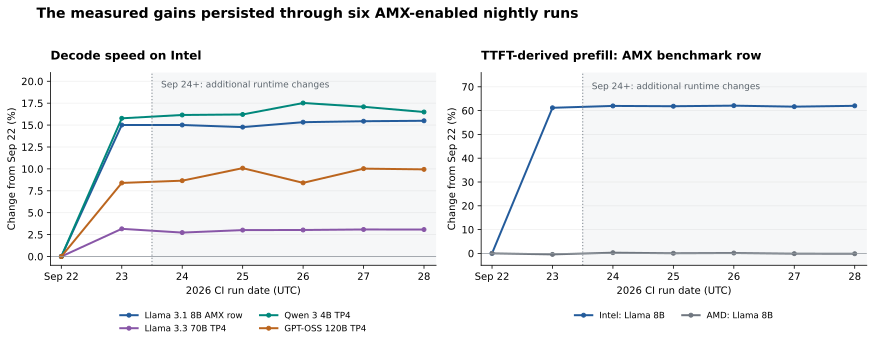

# AMX CI timeline: the first Pacific night was September 22

Written and updated September 28, 2026. The timeline below gives both Pacific daylight time (PDT, UTC−7) and UTC. The daily metric tables and chart retain UTC dates to match the package names, GitHub Actions, and Claude's original report.

**Short version.** AMX was enabled on September 22 Pacific time, and #4353 merged the following morning, September 23. Claude compared the correct packages, leaving one initial AMX-enabled nightly observation before the next attention optimization reached CI. The following nights show small additional prefill gains in some models and retain the large Llama 8B improvement, but the nightly comparisons do not isolate individual pull requests.

**Timestamp recheck: the user's note is correct.** The first AMX-enabled benchmark ran September 22 at 21:08–21:18 PDT. Its Slack report appeared September 23 at 06:05 PDT and prints exactly the remembered 32.5 TPS, approximately 354 prefill tokens/s, and 11,569 milliseconds to first token. The same benchmark is dated September 23 in UTC. #4353 merged September 23 at 08:50 PDT, so it did not merge on the Pacific calendar day when AMX was enabled.

| Event | Pacific date and time (PDT) | UTC date and time |
| --- | --- | --- |
| [Baseline AMX-row benchmark begins (28.25 tok/s)](https://github.com/positron-ai/systems_test/actions/runs/35683952944) | 09-21 21:10:12 | 09-22 04:10:12 |
| [#4505: enable AMX in nightly packages](https://github.com/positron-ai/tron/pull/4505) | 09-22 14:08:26 | 09-22 21:08:26 |
| [#4534: disable shared wait counters](https://github.com/positron-ai/tron/pull/4534) | 09-22 14:14:51 | 09-22 21:14:51 |
| [Build first AMX-enabled package, 5cf65b92](https://github.com/positron-ai/tron/actions/runs/35806901506) | 09-22 18:35:16 | 09-23 01:35:16 |
| [First AMX-enabled benchmark begins (32.49 tok/s)](https://github.com/positron-ai/systems_test/actions/runs/35815209295) | 09-22 21:08:11 | 09-23 04:08:11 |
| [Slack posts first AMX-enabled nightly report](https://positronai.slack.com/archives/C06S8PNDBQA/p1790168710568799?thread_ts=1790168710.568799&cid=C06S8PNDBQA) | 09-23 06:05:10 | 09-23 13:05:10 |
| [#4353: attention query-splitting optimization merges](https://github.com/positron-ai/tron/pull/4353) | 09-23 08:50:53 | 09-23 15:50:53 |
| [First benchmark with #4353 begins](https://github.com/positron-ai/systems_test/actions/runs/35952362421) | 09-23 21:06:59 | 09-24 04:06:59 |
| [Slack posts first report with #4353](https://positronai.slack.com/archives/C06S8PNDBQA/p1790255389003419?thread_ts=1790255389.003419&cid=C06S8PNDBQA) | 09-24 06:09:49 | 09-24 13:09:49 |

**Claude used the right comparison window.** Its baseline is the September 21 Pacific evening run, reported September 22, with package `2026.09.18-3faba6d0`. Its improved result is the September 22 Pacific evening run, reported September 23, with package `2026.09.23-5cf65b92`. Those are the actual 28.25 → 32.49 decode-token/s measurements. The date labels in Claude's document follow UTC/report dates. They do not select the wrong pair of runs.

Source ancestry confirms that #4353 is absent from both packages in Claude's comparison. It first appears in `2026.09.24-2a527a4b`, tested on the September 23 Pacific evening. The [saved membership check](../../exec/ci-amx-persistence-20260928/package-membership.json) also shows that #4505, #4534, and #4258 are present together in the first AMX-enabled package.

**How long before another performance change?** There is one nightly observation before #4353, on September 22 Pacific time. That benchmark finished 11 hours 32 minutes before #4353 merged. The gap between the AMX-enabling merge and #4353's merge is 18 hours 42 minutes. The next nightly, roughly 24 hours later, already contains #4353. There is no two- or three-day interval with the initial package's relevant runtime code unchanged.

Strictly, none of these nightly pairs isolates AMX alone. The wait-counter change #4534 merged 6 minutes 25 seconds after AMX enabling and shipped in the same first package. Claude's strong attribution for Llama 8B comes from the separate September 20 comparison of the same source built with and without AMX. Across the other models, the initial gains can include the wait-counter and accelerator-attention changes.

**What changed after #4353 reached CI?** The table compares September 22 → September 23 Pacific evenings, which are the September 23 → September 24 UTC reports. Both packages have AMX enabled. Decode is in tokens/s/user. Prefill is in tokens/s, calculated from prompt length divided by time to first token.

| Intel benchmark | Decode before → after | Decode change | Prefill before → after | Prefill change |
| --- | --- | --- | --- | --- |
| Llama 8B TP2, 32 users (AMX row) | 32.49 → 32.49 | +0.00% | 354.0 → 355.8 | +0.49% |
| Llama 70B TP4, 4 users | 31.33 → 31.20 | -0.42% | 208.5 → 208.6 | +0.08% |
| Qwen 3 4B TP2, 8 users | 183.62 → 185.69 | +1.13% | 2094.1 → 2174.1 | +3.82% |
| Qwen 3 4B TP4, 8 users | 172.12 → 172.68 | +0.33% | 1818.8 → 1845.0 | +1.44% |
| GPT-OSS 120B TP4, 8 users | 118.91 → 119.19 | +0.24% | 955.2 → 983.7 | +2.98% |

- The Llama 8B AMX row has effectively unchanged decode speed and 0.49% higher prefill. This is much smaller than its initial 15.0% decode and 61.2% prefill increases.
- GPT-OSS prefill increases 2.98% on the first updated night. Over all five subsequent nights, it remains 2.39–3.38% above the first AMX-enabled result. Qwen TP4 prefill remains 1.44–3.68% above that result. Thus these are observed, sustained package-level differences.
- The AMD machine's immediate changes are smaller or opposite for those prefill rows: GPT-OSS +0.49%, Qwen TP4 −1.49%, and Qwen TP2 −0.61%. That does not establish which change caused the Intel improvements.
- #4353's own GPT-OSS measurements use one user and roughly 2,000 or 32,000 prompt tokens. The nightly GPT-OSS row uses eight users per machine and 1,024 prompt tokens. Its reported 2.38%/4.28% prompt gains are therefore not predictions for this exact nightly row.
- The new package contains 31 further merges, including #4460's routing preparation changes. A before/after nightly comparison can establish a measured difference, but cannot attribute that difference to #4353 alone. The [full comparison CSV](../../exec/ci-amx-persistence-20260928/after-4353-comparison.csv) covers all 13 rows on both machines.

Later performance-relevant routing changes also arrive during the observed span. [#4461](https://github.com/positron-ai/tron/pull/4461) shares generated routing storage, and [#2750](https://github.com/positron-ai/tron/pull/2750) retains routing-buffer allocations. Both first appear in the September 26 Pacific nightly. Intel GPT-OSS decode rises 1.50% from the preceding night, to 120.70 tokens/s, but an earlier updated package had already reached 120.76 tokens/s. That change is not a distinct new best level. The September 27 Pacific package adds [#4492](https://github.com/positron-ai/tron/pull/4492) and [#4494](https://github.com/positron-ai/tron/pull/4494), changing routing traversal and row representation. GPT-OSS decode then changes −0.08%, and prefill changes +0.58%. These observations also do not isolate the individual changes. The [later PR descriptions and merge metadata](../../exec/ci-amx-persistence-20260928/later-prs.json) are preserved.

The original Llama 8B improvement remains visible on six Pacific nights, September 22–27, corresponding to the six UTC reports September 23–28. That is observed persistence across changing packages, not six days of AMX-only evidence.

**Detailed evidence below uses UTC run dates.** This preserves direct alignment with the earlier investigation and raw CI results.

**The document you remembered.** Claude's September 23 report is [“Did other merges change decode or prefill speed on 09-23?”](CI-merges-20260923.html). Its published copy is [the Claude artifact](https://claude.ai/artifact/XfjSvRGsrojxBN2qyHmc2t). The [session handoff](../../../../handoffs/claude_20260923_amx-benchmark-tps-regression-between-ci-runs.md) records the investigation and source files.

Claude concluded that AMX explained almost all of the Llama 8B benchmark's 15.0% decode gain. A prior comparison of the same source code built with and without AMX measured a 14.0% gain. The report separately identified other performance-relevant changes: [#4258](https://github.com/positron-ai/tron/pull/4258), which changes accelerator attention joins, and [#4534](https://github.com/positron-ai/tron/pull/4534), which disables shared wait counters. It treated #4534 as the likely, unconfirmed explanation for the extra Intel gains in three four-card models. It did **not** attribute every improved model to AMX alone.

**Terms and measurement.** AMX means Intel Advanced Matrix Extensions. CI means continuous integration. Tron is the inference program under test. Decode speed is generated tokens per second per user. TTFT is time to first token. The reported prefill rate is configured prompt length divided by mean TTFT, rounded to milliseconds first. This rate includes waiting behind other users' prompts. It is not aggregate engine throughput. TP2 and TP4 mean a model is split across two or four accelerator cards. A package suffix identifies the Tron source commit actually installed by the nightly job.

**How long, under each interpretation.**

- **Observed persistence: at least six consecutive nightly runs, September 23–28.** Llama 8B decode stayed 14.8–15.5% above September 22. Its TTFT-derived prefill rate stayed 61.2–62.1% above September 22. The series has no observed end to the improvement.
- **Before the next performance-relevant package: one nightly run, September 23.** The September 24 package already contains new attention scheduling and generated routing preparation changes. A two- or three-night window with unchanged relevant code does not exist.
- **AMX as the only meaningful main-branch change across all models: zero nightly runs.** [#4505](https://github.com/positron-ai/tron/pull/4505) enabled AMX in the package preset at September 22, 21:08:26 UTC. #4534 merged at 21:14:51 UTC, just 6 minutes 25 seconds later. Both are in the first AMX-enabled nightly package. This does not negate the independent same-code AMX result for Llama 8B.

**Llama 3.1 8B AMX benchmark: daily Intel results.** The load is unchanged across all seven runs: 32 users per machine, prompt length 4,096 tokens, 1,536 generated tokens, 10 rounds, and 320 completed requests. Each log identifies the same 332 eligible conversations and cycling order. The first row is the pre-AMX baseline. “Change” columns compare with that row.

| CI date | Package commit | Decode (tok/s/user) | Decode change | Prefill (tok/s) | Prefill change | TTFT (s) |
| --- | --- | --- | --- | --- | --- | --- |
| [09-22](https://github.com/positron-ai/systems_test/actions/runs/35683952944) | `3faba6d0` | 28.25 | +0.0% | 219.7 | +0.0% | 18.646 |
| [09-23](https://github.com/positron-ai/systems_test/actions/runs/35815209295) | `5cf65b92` | 32.49 | +15.0% | 354.0 | +61.2% | 11.569 |
| [09-24](https://github.com/positron-ai/systems_test/actions/runs/35952362421) | `2a527a4b` | 32.49 | +15.0% | 355.8 | +62.0% | 11.513 |
| [09-25](https://github.com/positron-ai/systems_test/actions/runs/36091251382) | `ea9d5121` | 32.43 | +14.8% | 355.5 | +61.8% | 11.522 |
| [09-26](https://github.com/positron-ai/systems_test/actions/runs/36215458085) | `dbeb404f` | 32.58 | +15.3% | 356.0 | +62.1% | 11.505 |
| [09-27](https://github.com/positron-ai/systems_test/actions/runs/36292138217) | `d3ff98db` | 32.62 | +15.4% | 355.1 | +61.6% | 11.535 |
| [09-28](https://github.com/positron-ai/systems_test/actions/runs/36375054938) | `ee2d5be0` | 32.63 | +15.5% | 355.9 | +62.0% | 11.510 |

The September 24–28 decode values remain within 0.42% of September 23. The prefill values remain within 0.56% of September 23. These observations support persistence of the original improvement. They do not isolate the AMX contribution in each later package.

**Where further performance changes enter.** [#4353](https://github.com/positron-ai/tron/pull/4353) merged on September 23 at 15:50:53 UTC (08:50:53 PDT). It splits software attention work within a page across processor cores by query. It also changes query bounds and bookkeeping in the shared attention path. Its own measurements report GPT-OSS prefill gains of 2.38% at roughly 2,000 prompt tokens and 4.28% at roughly 32,000 prompt tokens, plus a 1.03% decode gain at the longer prompt. Its Llama controls showed less than 1% movement under the tested loads. Those controls did not use this exact 4,096-token AMX benchmark.

The September 24 package is `2026.09.24-2a527a4b`. Its source contains #4353. The September 23 package, `2026.09.23-5cf65b92`, does not. This is a definite cutoff for claiming that later CI changes have no new attention optimization as a possible cause. It is not evidence that AMX stopped working.

There is an earlier possible cause for generated models: [#4460](https://github.com/positron-ai/tron/pull/4460) merged at September 23, 03:51:52 UTC. Its routing assignment is not yet used to share storage, but its preparation schedule is consumed by the code generator. A reusable routing slot can therefore move a channel preparation later. This makes it unsafe to dismiss the entire change as unused analysis. The hand-written Llama 8B AMX row does not use that generator path. #4460 also first reaches these nightly benchmarks in the September 24 package.

The first positive AMX benchmark ran at 04:08–04:18 UTC on September 23. Main had therefore already accepted #4460 when that benchmark ran, but the installed package still used the earlier source snapshot. A merge time does not identify the source snapshot installed by a CI job.

**Audit up to the new attention optimization.** Times in this table are GitHub's `mergedAt` values. They differ from the timestamps stored in some merge commits. No new controlled performance tests were run for these changes.

| PR | Merged at (UTC) | Change | Assessment |
| --- | --- | --- | --- |
| [4522](https://github.com/positron-ai/tron/pull/4522) | 2026-09-23 02:01:02 | Placement cleanup | Removes unused state. The random seed and placement sequence stay the same. |
| [4458](https://github.com/positron-ai/tron/pull/4458) | 2026-09-23 02:06:44 | Generated routing names | Fixes identifier resolution. It does not affect the hand-written Llama AMX row. |
| [4526](https://github.com/positron-ai/tron/pull/4526) | 2026-09-23 02:21:11 | Placement lock removal | Changes serial model loading. It does not change the placement sequence. |
| [4459](https://github.com/positron-ai/tron/pull/4459) | 2026-09-23 03:00:48 | Generated router identity | Separates logical identity from storage. Separate routing fields are still emitted. |
| [4009](https://github.com/positron-ai/tron/pull/4009) | 2026-09-23 03:00:48 | Prequantized cache format | Adds format helpers. Production loading is deferred to later changes. |
| [4460](https://github.com/positron-ai/tron/pull/4460) | 2026-09-23 03:51:52 | Routing preparation schedule | Potential performance change for generated mixture-of-experts models. Preparation timing can change even though shared fields are deferred. No AMX-row effect: its Llama model is hand-written. |
| [4206](https://github.com/positron-ai/tron/pull/4206) | 2026-09-23 14:27:17 | Future module interface | Adds an unused header. It has no runtime consumer. |
| [4551](https://github.com/positron-ai/tron/pull/4551) | 2026-09-23 15:39:37 | Comment correction | No executable change. |
| [4536](https://github.com/positron-ai/tron/pull/4536) | 2026-09-23 15:46:40 | Placement helper extraction | Computes the same device positions as the earlier loops. |
| [4353](https://github.com/positron-ai/tron/pull/4353) | 2026-09-23 15:50:53 | Attention work scheduling | Definite new optimization in a shared runtime path. Its own measurements report GPT-OSS prefill and decode gains. |

The complete [31-merge list for the successor package](../../exec/ci-amx-persistence-20260928/successor-package-merges.tsv) records the scope after September 23. The source diffs for [attention scheduling](../../exec/ci-amx-persistence-20260928/evidence/attention-split-4353.patch) and [routing preparation](../../exec/ci-amx-persistence-20260928/evidence/routing-preparation-4460.patch) are saved with this report.

**The other three model gains also persist.** All decode columns below use tokens per second per user. The prefill sequence is September 22 → September 23 → the September 24–28 range, in tokens per second. These are observations about the package changes, not AMX-only measurements.

| Model | Sep 22 decode | Sep 23 decode | Sep 24–28 decode range | Sep 28 decode change | Prefill sequence (tok/s) |
| --- | --- | --- | --- | --- | --- |
| Llama 3.3 70B TP4 | 30.37 | 31.33 | 31.20–31.31 | +3.1% | 208.2 → 208.5 → 208.6–209.4 |
| Qwen 3 4B TP4 | 148.67 | 172.12 | 172.68–174.71 | +16.5% | 1587.6 → 1818.8 → 1845.0–1885.8 |
| GPT-OSS 120B TP4 | 109.70 | 118.91 | 118.92–120.76 | +9.9% | 943.8 → 955.2 → 978.0–987.5 |

Qwen and GPT-OSS run accelerator attention in the original investigation. Llama 70B does not have the AMX kernel's supported attention shape. Persistence of their gains is therefore not proof of an AMX effect. The original wait-counter and accelerator-join explanations remain possible causes. The large Llama 8B AMX gain has stronger attribution evidence from the prior same-code comparison.

**AMD control for the same Llama 8B row.** AMD cannot run the Intel AMX kernel. Its decode remains near the September 22 baseline while Intel retains the large gain.

| CI date | Decode (tok/s/user) | Prefill (tok/s) | Completed requests |
| --- | --- | --- | --- |
| [09-22](https://github.com/positron-ai/systems_test/actions/runs/35682128668) | 29.00 | 308.8 | 320 |
| [09-23](https://github.com/positron-ai/systems_test/actions/runs/35813240282) | 28.91 | 307.4 | 320 |
| [09-24](https://github.com/positron-ai/systems_test/actions/runs/35950268913) | 28.64 | 309.6 | 320 |
| [09-25](https://github.com/positron-ai/systems_test/actions/runs/36089207076) | 28.73 | 308.9 | 320 |
| [09-26](https://github.com/positron-ai/systems_test/actions/runs/36213916576) | 28.55 | 309.2 | 320 |
| [09-27](https://github.com/positron-ai/systems_test/actions/runs/36290618045) | 28.73 | 308.4 | 320 |
| [09-28](https://github.com/positron-ai/systems_test/actions/runs/36372865242) | 28.76 | 308.3 | 320 |

The September 26–28 AMD workflows were cancelled later. Their Llama 8B rows each completed all 320 requests before cancellation. They are included only as completed row measurements. Other AMD rows have large anomalies, especially Llama 70B TP4, so this report does not assume the whole AMD workflow was healthy.

**Verification and limits.**

- Retrieved fresh September 24–28 job logs for both machines. Reused the preserved September 22–23 raw logs. Extracted 182 completed benchmark rows and 20,160 request records across 14 jobs.
- Checked every row against its expected request count and 10 running-average records. Recomputed means agree with the final logged averages within 0.011 decode tokens/s and 1.1 milliseconds of TTFT. The four original Llama 8B row records reproduce Claude's saved values exactly to floating-point precision.
- Verified that the AMX row's logged load settings and prompt dataset description are identical each day. The later test-harness commit changes quality-score threshold policy, not benchmark load or the prefill formula.
- Matched each installed package to its published build. The Debian package preset keeps `TRON_AMX_DISPATCH=ON` in all September 23–28 source snapshots. The AMX kernel source and interface are unchanged over that span.
- The workflow's overall failure or cancellation status is not treated as a missing performance measurement. A row is included only after all requests and rounds complete. Complete measurements can still contain machine effects.
- No new AMX on/off comparison was performed. No causal estimate is assigned to the small differences between later nights. Claude's 0.29 decode-token/s residual is a descriptive comparison with its earlier campaign, not a statistical upper bound on every other change.
- Prefill values come from logged per-request TTFT rounded to whole milliseconds. This matches the original report's method and the harness formula closely. A sub-millisecond rounding boundary can shift another model's reconstructed prefill slightly.

**Primary run and package evidence.**

| CI date | Installed package | CI run | Package build | Saved log evidence |
| --- | --- | --- | --- | --- |
| 2026-09-22 | `2026.09.18-3faba6d0` | [35683952944](https://github.com/positron-ai/systems_test/actions/runs/35683952944) | Prior package (Sep 18) | [Excerpt](../../exec/ci-amx-persistence-20260928/evidence/intel-35683952944.txt) |
| 2026-09-23 | `2026.09.23-5cf65b92` | [35815209295](https://github.com/positron-ai/systems_test/actions/runs/35815209295) | [35806901506](https://github.com/positron-ai/tron/actions/runs/35806901506) | [Excerpt](../../exec/ci-amx-persistence-20260928/evidence/intel-35815209295.txt) |
| 2026-09-24 | `2026.09.24-2a527a4b` | [35952362421](https://github.com/positron-ai/systems_test/actions/runs/35952362421) | [35943607917](https://github.com/positron-ai/tron/actions/runs/35943607917) | [Excerpt](../../exec/ci-amx-persistence-20260928/evidence/intel-35952362421.txt) |
| 2026-09-25 | `2026.09.25-ea9d5121` | [36091251382](https://github.com/positron-ai/systems_test/actions/runs/36091251382) | [36082605328](https://github.com/positron-ai/tron/actions/runs/36082605328) | [Excerpt](../../exec/ci-amx-persistence-20260928/evidence/intel-36091251382.txt) |
| 2026-09-26 | `2026.09.26-dbeb404f` | [36215458085](https://github.com/positron-ai/systems_test/actions/runs/36215458085) | [36208879581](https://github.com/positron-ai/tron/actions/runs/36208879581) | [Excerpt](../../exec/ci-amx-persistence-20260928/evidence/intel-36215458085.txt) |
| 2026-09-27 | `2026.09.27-d3ff98db` | [36292138217](https://github.com/positron-ai/systems_test/actions/runs/36292138217) | [36286329390](https://github.com/positron-ai/tron/actions/runs/36286329390) | [Excerpt](../../exec/ci-amx-persistence-20260928/evidence/intel-36292138217.txt) |
| 2026-09-28 | `2026.09.28-ee2d5be0` | [36375054938](https://github.com/positron-ai/systems_test/actions/runs/36375054938) | [36367243845](https://github.com/positron-ai/tron/actions/runs/36367243845) | [Excerpt](../../exec/ci-amx-persistence-20260928/evidence/intel-36375054938.txt) |

The [all-model CSV](../../exec/ci-amx-persistence-20260928/rows.csv) includes both machines. The [structured results](../../exec/ci-amx-persistence-20260928/results.json) retain request samples, row timestamps, settings, source line numbers, and log hashes. The [source metadata](../../exec/ci-amx-persistence-20260928/metadata.json) preserves PR descriptions, merge times, run statuses, build commits, and the main heads read during this investigation.

Reproduce the extraction with [analyze.py](../../exec/ci-amx-persistence-20260928/analyze.py). Download a source log with `gh run view RUN_ID -R positron-ai/systems_test --log`. Generate this report with [report.py](../../exec/ci-amx-persistence-20260928/report.py).
